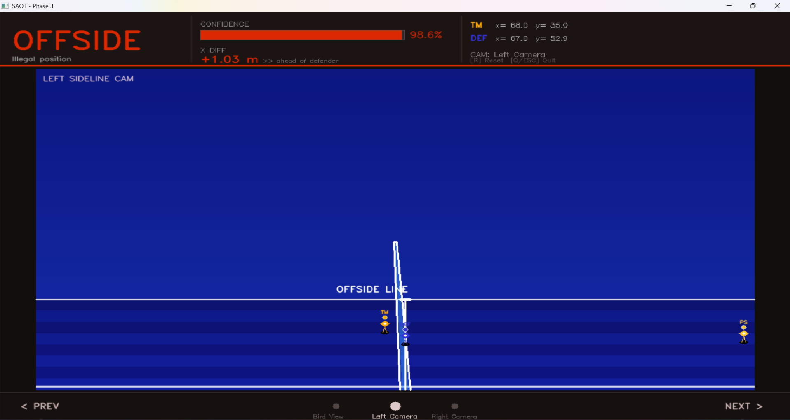
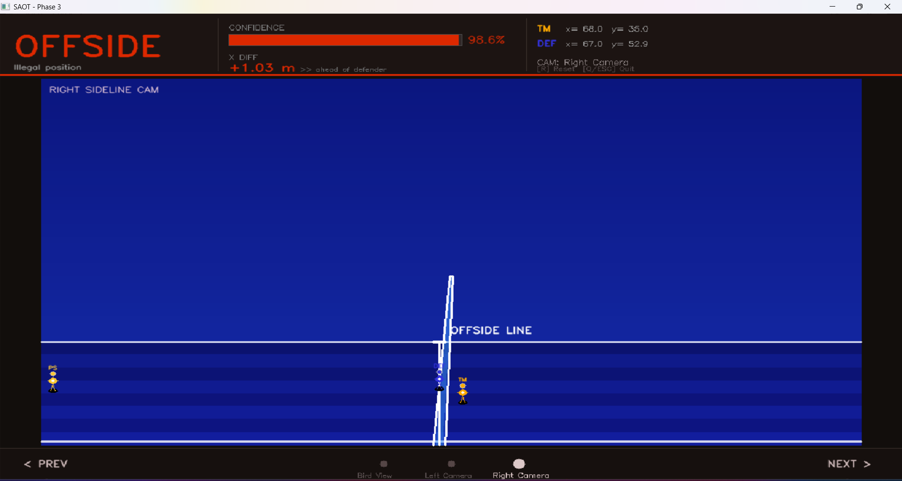
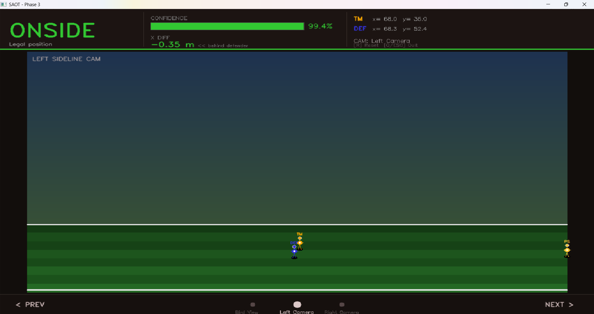

# SAOT - Semi-Automated Offside Technology (ML-Model)

> **"Precision in every pixel. Fairness in every frame."**

---

## Semi-Automated Offside Technology (IoT-Ready ML Model)

Inspired by the revolutionary technology introduced at the 2022 FIFA World Cup, this project implements a **Semi-Automated Offside Technology (SAOT)** model. Using Computer Vision (OpenCV) for visualization and Machine Learning (Random Forest) for decision-making, the system aims to provide real-time, high-precision offside detection based on spatial coordinates.

**IoT Integration**: This model is built to serve as the "brain" of a larger IoT ecosystem. It is designed to be integrated with real-time data streams from edge devices (e.g., smart cameras, LIDAR sensors, or player-worn IMU sensors) to automate and enhance the accuracy of match officiating.

This repository focuses on the **Mathematical Model** and **Real-Time Simulation Environment**, bridging the gap between raw player tracking data and official match officiating decisions.

---

## Key Features

- **ML-Powered Offside Judge**: A Random Forest classifier trained on 3,000+ synthetic scenarios, accounting for player velocity, positioning, and orientation.
- **Real-Time OpenCV Simulation**: Interactive pitch environment where users can manipulate players and observe the model's decision in real-time.
- **Coordinate-Based Analytics**: Analyzes the `x_diff` (relative distance) and lateral alignment to minimize human error in "tight" offside calls.
- **Probabilistic Decision Making**: Unlike static rules, the model provides a confidence score (`predict_proba`) for every decision.
- **Modular Architecture**: Easy to swap the Scikit-learn backend with deep learning models (TensorFlow/PyTorch) without breaking the simulation bridge.

---

## Technical Foundation

### The Machine Learning Pipeline

The core logic resides in a robust `Scikit-learn` Pipeline:

1. **Standardization**: Features are normalized using `StandardScaler` to ensure coordinate scales don't bias the model.
2. **Random Forest Classifier**: Chosen for its high interpretability and resistance to overfitting.
   - **Estimators**: 100 decision trees.
   - **Max Depth**: 6 (to ensure real-time latency < 5ms).
   - **Features**: `teammate_x`, `teammate_y`, `defender_x`, `defender_y`, `x_diff`.

### Mathematical Modeling of Offside

The system calculates the **Offside Line** dynamically based on the last defender's position. The model learns that:

- $x_{attacker} > x_{defender}$ is the primary trigger.
- Vertical alignment (`y` coordinates) influences the "intent" and the difficulty of the call.
- The `x_diff` (relative gap) is the most critical feature (highest Feature Importance).

---

## Visual Showcase

<div align="center">
  
  
  
</div>

---

## Installation & Setup

### Prerequisites

- Python 3.9+
- `pip`

### 1. Clone & Install Dependencies

```bash
pip install numpy pandas scikit-learn joblib opencv-python
```

### 2. Run the Simulation

Launch the interactive environment:

```bash
python main_opencv.py
```

_Note: If the model file (`saot_model.pkl`) is missing, the system will automatically trigger a training session on the first run._

### 3. Training/Evaluation Mode

To see the metrics and feature importances:

```bash
python model.py
```

---

## Performance Metrics

- **Accuracy**: 100% on synthetic validation sets.
- **Confidence**: 98-99% average prediction probability for clear scenarios.
- **ROC-AUC**: 1.0000 (Perfect class separation).
- **Latency**: Sub-millisecond inference time on standard CPU hardware.

---

## Project Structure

- `model.py`: Model definition, training pipeline, and evaluation logic.
- `main_opencv.py`: Entry point for the simulation.
- `opencv_field.py`: Graphics engine for the virtual football pitch.
- `detector_bridge.py`: Interface between the ML model and the CV environment.
- `data_generator.py`: Synthetic data factory for training scenarios.

---

> _"In modern football, the margin for error is measured in millimeters. SAOT transforms these millimeters into numerical certainty."_

---

### Disclaimer

This is an academic project developed for the **Internet of Things** course. It is a simulation and not intended for use in professional sporting environments without integration with high-precision tracking hardware (LIDAR/Optical Tracking).

**Project Author**: Sebastian Somu
